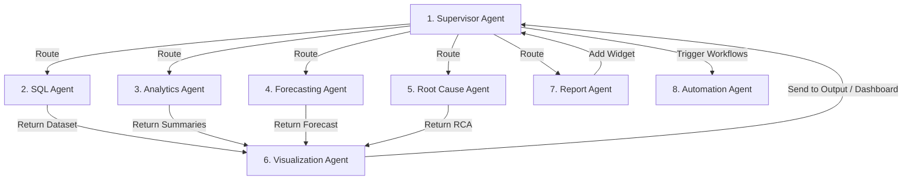
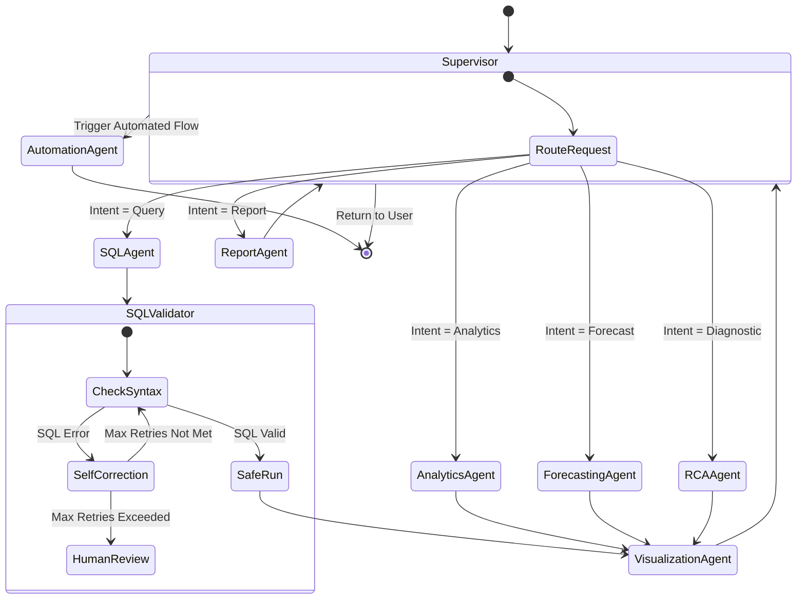

# Multi-Agent LangGraph System Architecture: InsightFlow

## Document Metadata
- **Product Name**: InsightFlow
- **Document Version**: 1.0.0
- **Status**: Draft
- **Author**: Principal LangGraph Architect
- **Target Release Date**: Q4 2026

---

### 1. Multi-Agent Team Definitions

InsightFlow utilizes a decentralized multi-agent system orchestrated using LangGraph. Each agent is modeled as a functional node with dedicated state, tools, and error-handling mechanisms.



---

#### 1.1 Supervisor Agent
- **Purpose**: Acts as the central cognitive router. Evaluates user input, classifies intent, maintains overall conversation state, delegates tasks to specialized sub-agents, and compiles the final response.
- **Inputs**: Raw user query, conversational history, and active tenant constraints.
- **Outputs**: Target agent routing commands, final formatted message, and task delegation actions.
- **Tools**: `RouteTaskTool`, `ListAvailableAgentsTool`.
- **Prompting Strategy**: Few-shot chain-of-thought routing prompts. Injects current system status, available agents, and user request history.
- **Memory Requirements**: Short-term conversation scratchpad (thread state) and long-term user profile settings (persistent store).
- **Failure Handling**: Routes to the general Analytics Agent if intent classification confidence drops below 70%.

#### 1.2 SQL Agent
- **Purpose**: Generates, validates, and runs secure read-only SQL queries to retrieve business metrics from data sources.
- **Inputs**: User question, matched semantic schema context (tables, fields).
- **Outputs**: Raw dataset (JSON), execution query string, execution speed metrics.
- **Tools**: `SchemaLookupTool`, `SafeSQLQueryRunTool`, `SQLSyntaxCheckerTool`.
- **Prompting Strategy**: Rigid structured text-to-SQL system prompts. Strictly forbids modifications (e.g., `INSERT`, `DROP`) and mandates output validation.
- **Memory Requirements**: Working memory of the current SQL generation attempt, retry loops, and error logs.
- **Failure Handling**: If SQL execution fails, sends the error trace back to the self-correction node for a maximum of 3 retries. If failures persist, routes to a Human-in-the-Loop check.

#### 1.3 Analytics Agent
- **Purpose**: Performs statistical operations on datasets (e.g., aggregations, trend analysis, mathematical ratios) and describes findings in natural language.
- **Inputs**: Raw SQL dataset, target analytical query.
- **Outputs**: Analytical summary, computed statistical margins, key observation list.
- **Tools**: `PandasStatisticalCalculatorTool`, `PercentDifferenceTool`.
- **Prompting Strategy**: Analytical template execution. Focuses the model on math precision, forbidding speculation beyond the numbers.
- **Memory Requirements**: Dataset state cache.
- **Failure Handling**: Falls back to showing the raw dataset in a table format if calculations time out or fail.

#### 1.4 Forecasting Agent
- **Purpose**: Generates univariate or multivariate time-series predictions.
- **Inputs**: Historical metric series, target forecast duration (e.g., "next quarter").
- **Outputs**: Forecast values array, lower/upper confidence bounds, model accuracy metrics (e.g., MAPE).
- **Tools**: `ProphetForecastingTool`, `ARIMAFittingTool`.
- **Prompting Strategy**: Parameters extraction prompting (e.g., extract seasonality types, confidence intervals) to pass to backend analytical packages.
- **Memory Requirements**: Historical data context array.
- **Failure Handling**: If data points are insufficient (minimum 14 data points required), alerts the supervisor to request a wider date range from the user.

#### 1.5 Root Cause Analysis (RCA) Agent
- **Purpose**: Diagnoses significant metric deviations by running statistical variance decomposition across dimension attributes.
- **Inputs**: Anomalous metric identifier, time-period comparisons.
- **Outputs**: Ordered list of contributing factors with weightings, narrative explanation of cause.
- **Tools**: `EntropyDriftCalculatorTool`, `DimensionVarianceAnalysisTool`.
- **Prompting Strategy**: Diagnostic reasoning prompts. Instructs the model to evaluate dimensions sequentially and translate weights into natural business stories.
- **Memory Requirements**: Variance metrics dataset.
- **Failure Handling**: Returns a basic top-level drift summary if deep dimensional analysis fails to identify significant statistical correlations.

#### 1.6 Visualization Agent
- **Purpose**: Selects the appropriate visualization format (e.g., line, bar, pie, scatter) and builds the front-end JSON render config.
- **Inputs**: Analytical dataset, query intent.
- **Outputs**: Shadcn UI / Recharts compatible JSON chart configuration.
- **Tools**: `ChartTypeRecommenderTool`.
- **Prompting Strategy**: Pure JSON schema enforcement. Prompts the model to return exactly the configured JSON schema structures without conversational fluff.
- **Memory Requirements**: Visual representation rules.
- **Failure Handling**: Defaults to a standard tabular grid visual layout if layout generation fails.

#### 1.7 Report Agent
- **Purpose**: Builds and edits multi-widget static dashboards, saving generated charts to dashboard objects.
- **Inputs**: Current dashboard configuration, target widget, query action (add/remove/reorder).
- **Outputs**: Modified dashboard layout state.
- **Tools**: `SaveWidgetTool`, `UpdateDashboardLayoutTool`.
- **Prompting Strategy**: Layout state machine mapping. Instructs the model to compute layout grids dynamically to prevent overlaps.
- **Memory Requirements**: Persistent dashboard grid states.
- **Failure Handling**: Rolls back dashboard state changes if grid layout collisions are detected.

#### 1.8 Automation Agent
- **Purpose**: Interface node with n8n triggers, scheduling alerts, routing Slack messages, and triggering external webhook calls.
- **Inputs**: Action target, trigger parameters, destination channel (e.g., Slack, webhook).
- **Outputs**: Task dispatch validation status.
- **Tools**: `n8nWebhookTriggerTool`, `SlackAlertPostTool`.
- **Prompting Strategy**: Action execution mapping. Extracts API schema payloads from chat messages.
- **Memory Requirements**: External API execution statuses.
- **Failure Handling**: Retries webhook dispatches asynchronously three times before adding a warning log in the user dashboard.

---

### 2. State Schema

```python
from typing import List, Dict, Any, TypedDict, Annotated
import operator

# Define global shared graph state
class AgentTeamState(TypedDict):
    # User Input & Context
    user_query: str
    tenant_id: str
    active_source_id: str
    
    # Conversational logs
    chat_history: List[Dict[str, str]]
    
    # Routing State
    next_agent: str
    current_run_id: str
    
    # Execution Data Cache
    generated_sql: str
    sql_execution_error: str
    raw_dataset: List[Dict[str, Any]]
    analytical_summary: str
    forecast_results: Dict[str, Any]
    rca_analysis: Dict[str, Any]
    visualization_config: Dict[str, Any]
    
    # Logs accumulators
    agent_logs: Annotated[List[Dict[str, Any]], operator.add]
```

---

### 3. Graph Design & Flow Control



---

### 4. Nodes & Execution Actions

1. **`supervisor_node`**: Receives `AgentTeamState`, executes classification, and updates the `next_agent` state attribute.
2. **`sql_generation_node`**: Interacts with `SchemaLookupTool` to retrieve schema references, calls the LLM to output the SQL query, and stores it in `generated_sql`.
3. **`sql_validation_node`**: Evaluates the SQL string using a syntax engine. If a syntax check fails, routes to the `sql_correction_node`. Otherwise, calls `SafeSQLQueryRunTool` to query the database.
4. **`sql_correction_node`**: Re-prompts the model with the database error trace. Increments the retry counter in the state metadata.
5. **`analytics_node`**: Runs standard python analytical calculations on `raw_dataset` using internal mathematical calculations tools.
6. **`forecasting_node`**: Compiles data, runs the forecasting algorithm, and updates `forecast_results`.
7. **`rca_node`**: Computes dimensional entropy variances to pinpoint anomalies.
8. **`visualization_node`**: Reviews data structure and maps it to a Recharts config file.
9. **`automation_node`**: Formats webhook payloads and dispatches them to the n8n automation engine.

---

### 5. Conditional Routing Logic

```python
# Router helper logic determining target execution node
def route_after_supervisor(state: AgentTeamState) -> str:
    """Evaluates next_agent value set by supervisor."""
    target = state.get("next_agent")
    if target in ["sql_agent", "analytics_agent", "forecasting_agent", "rca_agent", "report_agent"]:
        return target
    return "__end__"

def route_sql_validation(state: AgentTeamState) -> str:
    """Routes SQL node depending on execution outcome."""
    if state.get("sql_execution_error"):
        if len(state.get("agent_logs", [])) < 3: # Limit self-correction loops to 3
            return "sql_correction_node"
        return "human_intervention_node"
    return "visualization_node"
```

---

### 6. Tool Architecture

Tools are exposed to agents using Pydantic validation schemas to guarantee secure parameter constraints.

```
insightflow_tools/
├── db/
│   ├── schema_lookup.py        # Cosine search over table column structures
│   └── safe_query_executor.py  # Executes read-only queries with timeouts
├── math/
│   ├── stats_calculator.py     # Aggregations, drift, and ratios
│   └── forecaster_runner.py    # Runs backend Prophet/ARIMA forecasts
└── integrations/
    └── n8n_webhook.py          # Dispatches structured webhook parameters
```

---

### 7. Human-In-The-Loop (HITL) Points

InsightFlow incorporates three critical state verification gates that halt automated execution, prompt users, and await feedback:

1. **SQL Validation Gate**:
   - **Trigger**: When an LLM-generated SQL query fails syntax checks or times out more than 3 times consecutively.
   - **Action**: State is saved to the operational database. The system sends a notification to the user displaying the SQL query, the database error trace, and a text box to manually edit the SQL.
   - **Resolution**: Execution resumes once the user submits corrected SQL or clicks "Cancel Run".
2. **Dashboard Modification Approval**:
   - **Trigger**: The Report Agent attempts to overwrite an existing dashboard workspace layout.
   - **Action**: LangGraph triggers an interrupt. The frontend displays a side-by-side layout diff modal comparison.
   - **Resolution**: Awaits user approval click ("Overwrite Layout" vs "Discard Changes") before committing the state changes.
3. **Workflow Dispatch Verification**:
   - **Trigger**: The Automation Agent prepares to trigger an integration action containing external API payloads (e.g., sending email marketing lists via HubSpot).
   - **Action**: Execution pauses. The user is prompted: *"Confirm dispatch of marketing list to HubSpot?"*
   - **Resolution**: Continues execution only after active user signature confirmation.

---

File Name: docs/AGENTS.md
