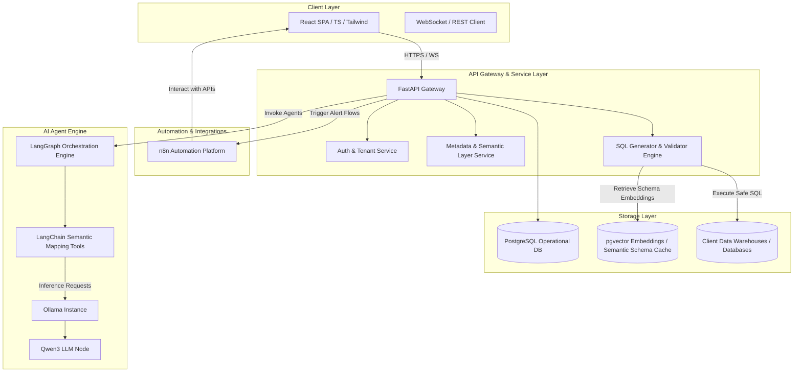
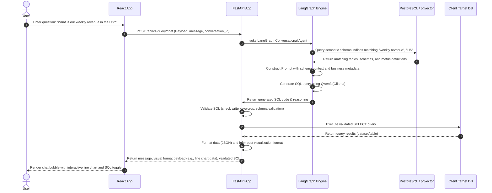
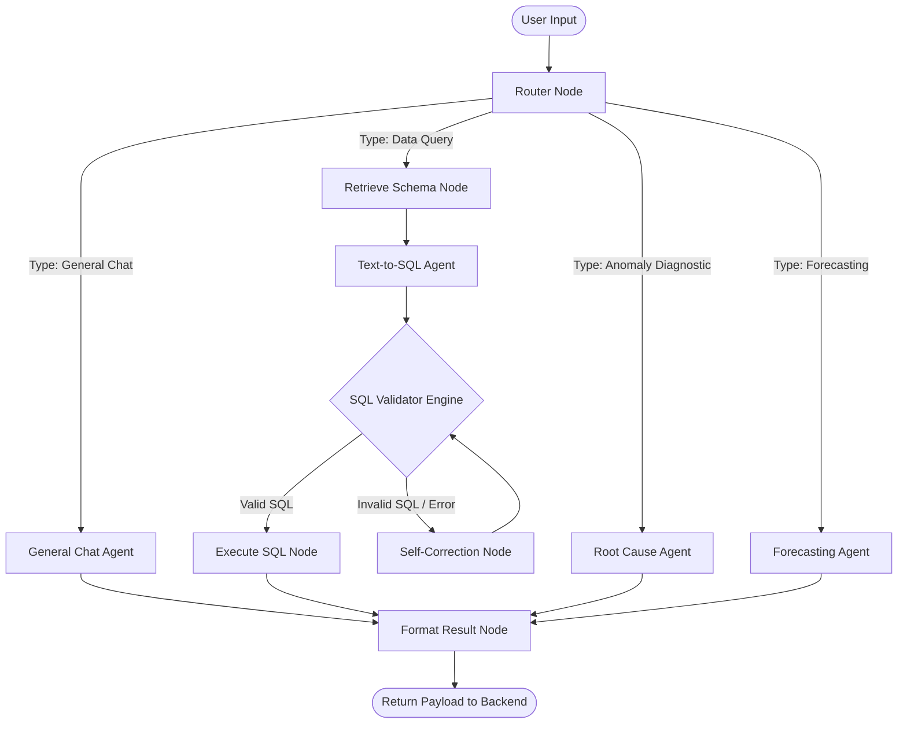
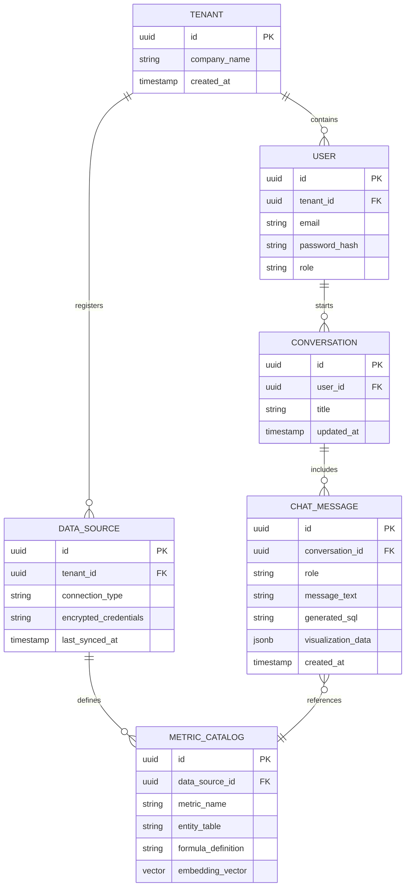
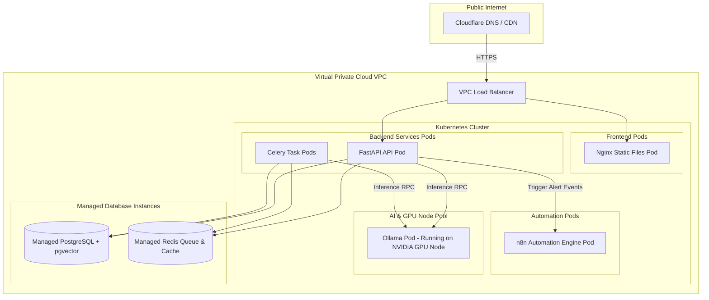

# Architecture Design Document: InsightFlow

## Document Metadata
- **Product Name**: InsightFlow
- **Document Version**: 1.0.0
- **Status**: Draft
- **Authors**:
  - Principal Software Architect
  - AI Systems Architect
  - Solutions Architect
- **Target Release Date**: Q4 2026

---

### 1. High-Level Architecture
InsightFlow is designed as a secure, distributed, modular, AI-first SaaS platform. The system is split into:
- **Client Layer**: A single-page application (SPA) built using React, TypeScript, Tailwind CSS, and Shadcn UI.
- **API & Orchestration Layer (Backend)**: Built with FastAPI, acting as the centralized service gateway handling routing, authentication, query execution, metadata catalog management, and workflow dispatching.
- **AI Agent Execution Engine**: Powered by LangChain and LangGraph, managing conversational analytics (Text-to-SQL), multi-step root cause analysis (RCA), and time-series forecasting. The LLM execution uses Ollama hosting local Qwen3 models (with fallbacks to proprietary APIs if needed).
- **Automation Hub**: Orchestrated via self-hosted n8n instances, handling integrations, alert notifications, and external workflow execution.
- **Data & Storage Layer**: PostgreSQL acting as the operational transactional store, and pgvector facilitating semantic searching, metadata indexing, and vector embeddings of database schemas.

---

### 2. System Components

#### 2.1 Component Diagram


#### 2.2 Component Descriptions
1. **Frontend SPA**: Serves the user interface for conversation, interactive dashboards, root cause reporting, and the semantic catalog editor.
2. **FastAPI Backend Gateway**: Manages state, API authentication, session validation, and wraps the AI execution pipelines in high-throughput endpoints.
3. **LangGraph Orchestrator**: Manages stateful, multi-agent workflows. It coordinates the routing of questions from users (determining if they need a simple Text-to-SQL translation, a diagnostic metric drift analysis, or a forecast).
4. **Ollama / Qwen3 LLM Node**: Local runtime execution node for Qwen3, optimizing privacy, security, and low latency while executing complex reasoning and SQL generation tasks.
5. **n8n Instance**: Manages outward-facing system events, alerting, webhooks, and SaaS integration syncs.
6. **Metadata & Storage Layer**: PostgreSQL keeps track of user profiles, organization settings, API credentials (encrypted), dashboards, alerts, and transaction records. pgvector is utilized to embed database schema definitions so that the AI can perform semantic matching of user questions to database columns.

---

### 3. Data Flow
The sequence of a user query flow from a natural language question to a generated visual dashboard chart.

#### 3.1 Conversational Query Flow (NL-to-SQL)


---

### 4. Frontend Architecture
The React frontend is designed with a structured feature-based approach, combining modular state management with high-performance visualization components.

#### 4.1 Technology Stack & Packages
- **State Management**: Zustand (lightweight, reactive, multi-store architecture).
- **Routing**: React Router v6.
- **Charts / Visualizations**: Recharts (for highly interactive responsive SVG elements).
- **CSS / Component Library**: Tailwind CSS, Shadcn UI (Radix UI primitives).
- **Animations**: Framer Motion (for chat entry transitions, anomaly slide-overs, and loading skeletons).
- **Query / Network**: TanStack Query v5 (React Query) for API caching and mutation handling.

#### 4.2 Folder Structure
```
frontend/
├── src/
│   ├── assets/          # Static assets, logos, fonts
│   ├── components/      # Global shared UI components (Button, Input, Modal, etc.)
│   ├── context/         # Auth, Theme contexts
│   ├── features/        # Feature-driven modules
│   │   ├── chat/        # Conversational interface components, state, hooks
│   │   ├── dashboard/   # Grid layout, metric cards, customizable charts
│   │   ├── catalog/     # Semantic layer catalog manager, schema viewer
│   │   └── alerts/      # Anomaly list, threshold config, n8n webhook setup
│   ├── hooks/           # Global utility hooks (useWebSocket, useAuth)
│   ├── services/        # API clients (Axios wrappers, WebSockets)
│   ├── store/           # Zustand stores (useChatStore, useCatalogStore)
│   └── utils/           # Helper functions, formatters
```

---

### 5. Backend Architecture
The backend is structured as an asynchronous FastAPI application, prioritizing speed, clean division of concerns, and ease of scaling.

#### 5.1 Technology Stack & Libraries
- **Web Framework**: FastAPI (Uvicorn as ASGI server).
- **ORM**: SQLModel / SQLAlchemy (asynchronous session management).
- **Task Queue**: Celery with Redis broker (for running asynchronous root cause analyses, forecasts, and schema re-indexing).
- **Validation**: Pydantic v2.

#### 5.2 Folder Structure
```
backend/
├── app/
│   ├── api/             # API Router endpoints
│   │   ├── v1/
│   │   │   ├── auth.py
│   │   │   ├── query.py
│   │   │   ├── catalog.py
│   │   │   └── alert.py
│   ├── core/            # Configuration, security, database sessions
│   ├── models/          # SQLModel / SQLAlchemy entities (Pydantic validation schemas)
│   ├── services/        # Core business logic engines
│   │   ├── query_exec.py# Safe execution wrapper for external databases
│   │   ├── catalog_mgr.py# Semantic Layer sync and schema indexing
│   │   └── forecaster.py# Prophet/ARIMA integration logic
│   ├── workers/         # Celery task definitions
│   └── main.py          # FastAPI application initialization
```

---

### 6. AI Architecture
InsightFlow implements a local-first AI system design with secure guardrails. The architecture ensures that natural language questions translate strictly into compliant SQL queries without executing arbitrary shell scripts.

#### 6.1 Inference Pipeline
- **Local Model Serving**: Ollama is hosted inside the virtual private cloud network, running `qwen3:14b-instruct` or `qwen3:32b-instruct` depending on complexity/latency trade-offs.
- **Prompt Engineering Strategy**: Structured output parsing using Pydantic parser tools inside LangChain. The model is injected with the semantic schema and instructed to return only a JSON object containing the SQL and the logical explanation.
- **Semantic Data Catalog**:
  1. Schemas are converted into descriptive markdown files (e.g., table structure, relations, sample data, dimension descriptions).
  2. These files are embedded using a local embedding model (e.g., `nomic-embed-text`) and saved to pgvector.
  3. When a user asks a question, the vector database returns only the schemas and metric definitions relevant to the query context, keeping prompt sizes minimal and avoiding model distraction.

---

### 7. LangGraph Architecture
LangGraph is used to build a stateful, cyclical graph structure governing user requests. This enables complex, multi-turn reasoning and agent workflows that are hard to orchestrate with simple linear chains.

#### 7.1 LangGraph State & Agent Workflow


#### 7.2 Graph Node Definitions
- **Router Node**: Classifies user input. Determines if the request is a simple data retrieval query, a request for forecasting a metric, an anomaly diagnostic, or general conversation.
- **Retrieve Schema Node**: Fetches relevant tables and semantic documentation from pgvector based on the query token embeddings.
- **Text-to-SQL Agent**: Generates the raw SQL utilizing the schema context.
- **SQL Validator Node**: Performs static syntax analysis, parsing the SQL abstract syntax tree (AST) using `sqlparse` to block non-SELECT statements (INSERT, UPDATE, DELETE, DROP) and prevent SQL injection.
- **Self-Correction Node**: If the validator or the database returns an execution error, this node sends the error trace back to Qwen3 with instructions to fix the SQL code and try again (up to 3 retries).
- **Root Cause Agent (RCA)**: Coordinates metric comparisons, runs drift analysis, and produces narrative summaries explaining metric changes.
- **Forecasting Agent**: Prepares historical time-series data, routes it to time-series forecasting models (Prophet/ARIMA), and processes forecast predictions with intervals.

---

### 8. Database Architecture
PostgreSQL with pgvector handles both application state, security mapping, metadata logs, and vector schema indexes.

#### 8.1 Database Schema


---

### 9. Security Architecture
InsightFlow places security at the foundation to build trust as a business intelligence platform.

1. **Multitenancy Isolation**:
   - Every database table incorporates a `tenant_id` column.
   - Database operations execute using a tenant filter, preventing data leakage across clients (Logical Isolation).
2. **SQL Execution Guardrails**:
   - Backend queries are routed to target client warehouses through a restricted user profile with **read-only permissions** (SELECT) on pre-approved tables.
   - The platform intercepts write keywords (`DROP`, `ALTER`, `TRUNCATE`, `UPDATE`, `INSERT`, `DELETE`) before SQL compile steps.
3. **API Security**:
   - JSON Web Tokens (JWT) are signed via HS256, carrying user roles and tenant identifiers.
   - Short expiration times (15 minutes) for access tokens, with secure HTTP-only refresh tokens.
4. **Data Isolation (Local LLM)**:
   - Inference runs locally on self-hosted Ollama containers within our Kubernetes clusters. No metadata or business data leaves the cluster to train public generative models.

---

### 10. Deployment Architecture
InsightFlow is deployed using containerized architectures orchestrated by Kubernetes, optimizing resource scheduling between CPU applications (FastAPI) and GPU analytical workloads (Ollama/Qwen3).



---

### 11. API Communication Flow
Communication patterns between the Frontend Client, FastAPI Gateway, LangGraph Agents, and n8n processes.

- **REST APIs**: Used for resource CRUD operations (managing database connections, tenant settings, catalog curation, and user profiles).
- **WebSockets**: Used for real-time conversational interfaces. Chat messages are streamed line-by-line or token-by-token to provide high perceived responsiveness.
- **Asynchronous Task Polling (Celery)**: Used for long-running analyses.
  - The client issues a post request (`POST /api/v1/query/diagnose`).
  - Backend returns a `task_id` immediately with HTTP status `202 Accepted`.
  - The client polls the status endpoint (`GET /api/v1/query/task/{task_id}`) or awaits a WebSocket notification when the task completes.
- **n8n Webhook Triggers**:
  - InsightFlow pushes alert notifications to n8n via HTTP POST webhooks.
  - n8n processes the alert payload, applies filtering logic, and routes it to destination integrations (Slack, Email, SMS).

---

File Name: docs/ARCHITECTURE_sydney.md
