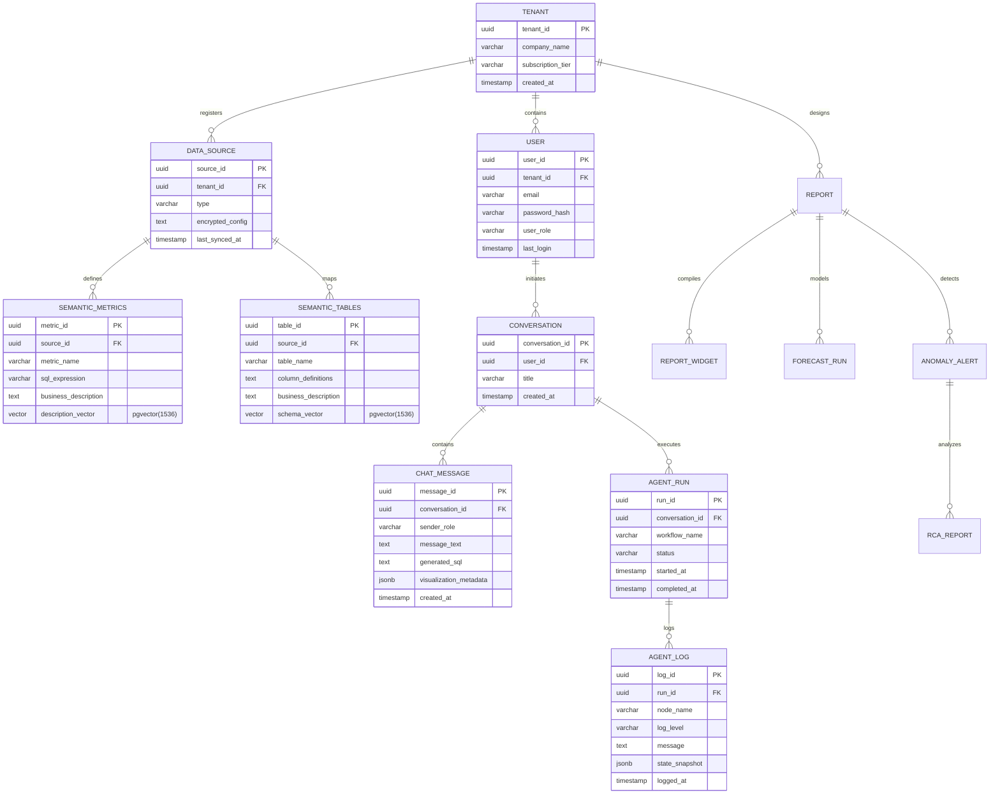

# PostgreSQL Database Schema Design: InsightFlow

## Document Metadata
- **Product Name**: InsightFlow
- **Document Version**: 1.0.0
- **Status**: Draft
- **Author**: Senior Data Architect
- **Target Release Date**: Q4 2026

---

### 1. ER Diagram

The platform's database structure is divided into two primary logical schemas:
1. **System Schema (`insightflow_system`)**: Tracks SaaS multi-tenancy, user profiles, metadata, semantic metric layers, conversations, reports, and agent execution runs.
2. **Client Analytics Schema (`client_analytics`)**: The target analytical data warehouse structure containing Sales, Customers, Inventory, and Marketing data to be queried by the AI agent.



---

### 2. Database Schema

All database operations run on PostgreSQL (v16+) with the `pgvector` extension enabled.

```sql
-- Enable necessary extensions
CREATE EXTENSION IF NOT EXISTS "uuid-ossp";
CREATE EXTENSION IF NOT EXISTS "vector";

-- Create logical system schema
CREATE SCHEMA IF NOT EXISTS insightflow_system;
```

---

### 3. Table Definitions

#### 3.1 Tenants & Users (Multi-Tenancy)
```sql
CREATE TABLE insightflow_system.tenants (
    tenant_id UUID PRIMARY KEY DEFAULT uuid_generate_v4(),
    company_name VARCHAR(255) NOT NULL,
    subscription_tier VARCHAR(50) NOT NULL CHECK (subscription_tier IN ('Growth', 'Enterprise', 'Custom')),
    created_at TIMESTAMP WITH TIME ZONE DEFAULT CURRENT_TIMESTAMP,
    updated_at TIMESTAMP WITH TIME ZONE DEFAULT CURRENT_TIMESTAMP
);

CREATE TABLE insightflow_system.users (
    user_id UUID PRIMARY KEY DEFAULT uuid_generate_v4(),
    tenant_id UUID NOT NULL REFERENCES insightflow_system.tenants(tenant_id) ON DELETE CASCADE,
    email VARCHAR(255) NOT NULL UNIQUE,
    password_hash VARCHAR(255) NOT NULL,
    user_role VARCHAR(50) NOT NULL CHECK (user_role IN ('Admin', 'Analyst', 'Business User')),
    first_name VARCHAR(100),
    last_name VARCHAR(100),
    created_at TIMESTAMP WITH TIME ZONE DEFAULT CURRENT_TIMESTAMP,
    updated_at TIMESTAMP WITH TIME ZONE DEFAULT CURRENT_TIMESTAMP
);
```

#### 3.2 Data Sources & Semantic Layer
```sql
CREATE TABLE insightflow_system.data_sources (
    source_id UUID PRIMARY KEY DEFAULT uuid_generate_v4(),
    tenant_id UUID NOT NULL REFERENCES insightflow_system.tenants(tenant_id) ON DELETE CASCADE,
    source_name VARCHAR(100) NOT NULL,
    connection_type VARCHAR(50) NOT NULL CHECK (connection_type IN ('PostgreSQL', 'Snowflake', 'BigQuery', 'Redshift')),
    encrypted_credentials TEXT NOT NULL, -- Encrypted via AES-256 GCM in Python backend
    is_active BOOLEAN DEFAULT TRUE,
    last_synced_at TIMESTAMP WITH TIME ZONE,
    created_at TIMESTAMP WITH TIME ZONE DEFAULT CURRENT_TIMESTAMP
);

-- pgvector semantic cache for AI metric lookup
CREATE TABLE insightflow_system.semantic_metrics (
    metric_id UUID PRIMARY KEY DEFAULT uuid_generate_v4(),
    source_id UUID NOT NULL REFERENCES insightflow_system.data_sources(source_id) ON DELETE CASCADE,
    metric_name VARCHAR(100) NOT NULL,
    sql_expression TEXT NOT NULL,
    business_description TEXT NOT NULL,
    description_vector vector(1536), -- 1536 dimensions for OpenAI text-embedding-3-large / nomic-embed
    created_at TIMESTAMP WITH TIME ZONE DEFAULT CURRENT_TIMESTAMP,
    updated_at TIMESTAMP WITH TIME ZONE DEFAULT CURRENT_TIMESTAMP,
    CONSTRAINT unique_tenant_metric UNIQUE (source_id, metric_name)
);

-- pgvector semantic cache for AI schema lookup
CREATE TABLE insightflow_system.semantic_tables (
    table_id UUID PRIMARY KEY DEFAULT uuid_generate_v4(),
    source_id UUID NOT NULL REFERENCES insightflow_system.data_sources(source_id) ON DELETE CASCADE,
    table_name VARCHAR(100) NOT NULL,
    column_definitions JSONB NOT NULL,
    business_description TEXT NOT NULL,
    schema_vector vector(1536), -- Vector representation of table schema metadata
    created_at TIMESTAMP WITH TIME ZONE DEFAULT CURRENT_TIMESTAMP,
    CONSTRAINT unique_tenant_table UNIQUE (source_id, table_name)
);
```

#### 3.3 Chat & Analytics Logs
```sql
CREATE TABLE insightflow_system.conversations (
    conversation_id UUID PRIMARY KEY DEFAULT uuid_generate_v4(),
    user_id UUID NOT NULL REFERENCES insightflow_system.users(user_id) ON DELETE CASCADE,
    title VARCHAR(255) NOT NULL DEFAULT 'New Analytics Chat',
    created_at TIMESTAMP WITH TIME ZONE DEFAULT CURRENT_TIMESTAMP,
    updated_at TIMESTAMP WITH TIME ZONE DEFAULT CURRENT_TIMESTAMP
);

CREATE TABLE insightflow_system.chat_messages (
    message_id UUID PRIMARY KEY DEFAULT uuid_generate_v4(),
    conversation_id UUID NOT NULL REFERENCES insightflow_system.conversations(conversation_id) ON DELETE CASCADE,
    sender_role VARCHAR(50) NOT NULL CHECK (sender_role IN ('user', 'assistant')),
    message_text TEXT NOT NULL,
    generated_sql TEXT,
    visualization_metadata JSONB, -- Stores chart config parameters (e.g., {"type": "line", "xKey": "week", "yKeys": ["revenue"]})
    created_at TIMESTAMP WITH TIME ZONE DEFAULT CURRENT_TIMESTAMP
);
```

#### 3.4 Agent Execution Logs
```sql
CREATE TABLE insightflow_system.agent_runs (
    run_id UUID PRIMARY KEY DEFAULT uuid_generate_v4(),
    conversation_id UUID NOT NULL REFERENCES insightflow_system.conversations(conversation_id) ON DELETE CASCADE,
    workflow_name VARCHAR(100) NOT NULL, -- e.g., 'text_to_sql', 'root_cause_analysis', 'forecast'
    status VARCHAR(50) NOT NULL CHECK (status IN ('pending', 'running', 'completed', 'failed')),
    started_at TIMESTAMP WITH TIME ZONE DEFAULT CURRENT_TIMESTAMP,
    completed_at TIMESTAMP WITH TIME ZONE
);

CREATE TABLE insightflow_system.agent_logs (
    log_id UUID PRIMARY KEY DEFAULT uuid_generate_v4(),
    run_id UUID NOT NULL REFERENCES insightflow_system.agent_runs(run_id) ON DELETE CASCADE,
    node_name VARCHAR(100) NOT NULL, -- LangGraph Node name e.g., 'sql_validator'
    log_level VARCHAR(20) NOT NULL CHECK (log_level IN ('DEBUG', 'INFO', 'WARNING', 'ERROR')),
    message TEXT NOT NULL,
    state_snapshot JSONB, -- LangGraph state snapshot at the time of execution
    logged_at TIMESTAMP WITH TIME ZONE DEFAULT CURRENT_TIMESTAMP
);
```

#### 3.5 Reports, Forecasting & Root Cause Analysis
```sql
CREATE TABLE insightflow_system.reports (
    report_id UUID PRIMARY KEY DEFAULT uuid_generate_v4(),
    tenant_id UUID NOT NULL REFERENCES insightflow_system.tenants(tenant_id) ON DELETE CASCADE,
    title VARCHAR(255) NOT NULL,
    description TEXT,
    created_by UUID REFERENCES insightflow_system.users(user_id) ON DELETE SET NULL,
    created_at TIMESTAMP WITH TIME ZONE DEFAULT CURRENT_TIMESTAMP,
    updated_at TIMESTAMP WITH TIME ZONE DEFAULT CURRENT_TIMESTAMP
);

CREATE TABLE insightflow_system.report_widgets (
    widget_id UUID PRIMARY KEY DEFAULT uuid_generate_v4(),
    report_id UUID NOT NULL REFERENCES insightflow_system.reports(report_id) ON DELETE CASCADE,
    title VARCHAR(150) NOT NULL,
    query_sql TEXT NOT NULL,
    visualization_config JSONB NOT NULL,
    layout_position JSONB NOT NULL, -- e.g., {"x": 0, "y": 0, "w": 6, "h": 4}
    created_at TIMESTAMP WITH TIME ZONE DEFAULT CURRENT_TIMESTAMP
);

CREATE TABLE insightflow_system.forecast_runs (
    forecast_id UUID PRIMARY KEY DEFAULT uuid_generate_v4(),
    tenant_id UUID NOT NULL REFERENCES insightflow_system.tenants(tenant_id) ON DELETE CASCADE,
    target_metric VARCHAR(100) NOT NULL,
    forecast_model VARCHAR(50) NOT NULL, -- e.g., 'Prophet', 'ARIMA'
    historical_start_date DATE NOT NULL,
    forecast_end_date DATE NOT NULL,
    forecast_results JSONB NOT NULL, -- Predictions array: [{"date": "2026-07-01", "predicted_value": 12050, "upper": 12500, "lower": 11600}]
    created_by UUID REFERENCES insightflow_system.users(user_id) ON DELETE SET NULL,
    created_at TIMESTAMP WITH TIME ZONE DEFAULT CURRENT_TIMESTAMP
);

CREATE TABLE insightflow_system.anomaly_alerts (
    alert_id UUID PRIMARY KEY DEFAULT uuid_generate_v4(),
    tenant_id UUID NOT NULL REFERENCES insightflow_system.tenants(tenant_id) ON DELETE CASCADE,
    target_metric VARCHAR(100) NOT NULL,
    detected_value NUMERIC(15,4) NOT NULL,
    expected_value NUMERIC(15,4) NOT NULL,
    deviation_percentage NUMERIC(5,2) NOT NULL,
    status VARCHAR(50) NOT NULL CHECK (status IN ('active', 'acknowledged', 'resolved')),
    detected_at TIMESTAMP WITH TIME ZONE DEFAULT CURRENT_TIMESTAMP,
    resolved_at TIMESTAMP WITH TIME ZONE
);

CREATE TABLE insightflow_system.rca_reports (
    rca_id UUID PRIMARY KEY DEFAULT uuid_generate_v4(),
    alert_id UUID NOT NULL REFERENCES insightflow_system.anomaly_alerts(alert_id) ON DELETE CASCADE,
    summary TEXT NOT NULL, -- Generative AI text detailing explanation
    contributing_factors JSONB NOT NULL, -- Detailed list of weightings: [{"dimension": "region", "value": "Germany", "weight": -0.85}]
    generated_at TIMESTAMP WITH TIME ZONE DEFAULT CURRENT_TIMESTAMP
);
```

---

### 4. Relationships

- **Tenants to Users (1:N)**: One tenant has multiple users. Cascades on tenant deletion.
- **Tenants to Data Sources (1:N)**: A tenant connects to one or more databases (PostgreSQL, Snowflake, etc.).
- **Data Source to Semantics (1:N)**: A connected data source defines many semantic table mappings and metric configurations.
- **Users to Conversations (1:N)**: Conversations are owned by users.
- **Conversations to Chat Messages (1:N)**: A single conversation contains sequential chat history.
- **Conversations to Agent Runs (1:N)**: Track every action execution run triggered in a specific chat session.
- **Agent Runs to Agent Logs (1:N)**: Comprehensive step-by-step logs for node-level operations within a LangGraph execution.
- **Alerts to RCA Reports (1:1)**: An anomaly alert generates exactly one diagnostic Root Cause Analysis report.

---

### 5. Constraints

1. **Foreign Key Integrity**: All foreign keys utilize UUIDs to ensure secure, globally unique identifiers and enforce relational cascades.
2. **Subscription Tier Enforcement**: Standardized checks limit `subscription_tier` values to `('Growth', 'Enterprise', 'Custom')`.
3. **User Role Enforcement**: Limits access control rules directly inside the schema constraints: `CHECK (user_role IN ('Admin', 'Analyst', 'Business User'))`.
4. **Unique Context Identifiers**: Metric naming rules enforce uniqueness per source (`unique_tenant_metric`) preventing naming collision during AI search.

---

### 6. Indexing Strategy

To handle high concurrency and fast search, we utilize mixed B-Tree, GIN, and HNSW index formats:

```sql
-- Indexes for Multi-Tenant Isolation Filters
CREATE INDEX idx_users_tenant ON insightflow_system.users(tenant_id);
CREATE INDEX idx_data_sources_tenant ON insightflow_system.data_sources(tenant_id);
CREATE INDEX idx_reports_tenant ON insightflow_system.reports(tenant_id);
CREATE INDEX idx_anomaly_alerts_tenant ON insightflow_system.anomaly_alerts(tenant_id);

-- Performance Indexes for conversational query views
CREATE INDEX idx_conversations_user ON insightflow_system.conversations(user_id);
CREATE INDEX idx_chat_messages_conv ON insightflow_system.chat_messages(conversation_id);

-- JSONB indexing for custom visualization schema parsing (GIN index)
CREATE INDEX idx_chat_messages_viz ON insightflow_system.chat_messages USING gin (visualization_metadata);
CREATE INDEX idx_report_widgets_config ON insightflow_system.report_widgets USING gin (visualization_config);

-- Agent run performance index
CREATE INDEX idx_agent_logs_run ON insightflow_system.agent_logs(run_id);
```

---

### 7. pgvector Usage

To retrieve relevant context definitions for the Text-to-SQL agent, we store schema embeddings and run cosine distance queries.

#### 7.1 Creating Vector Indexes
We use Hierarchical Navigable Small World (HNSW) indexes for approximate nearest neighbor search to ensure queries execute under 10ms.

```sql
-- HNSW Index for metric similarity search (Cosine distance operator: vector_cosine_ops)
CREATE INDEX idx_semantic_metrics_vector ON insightflow_system.semantic_metrics 
USING hnsw (description_vector vector_cosine_ops);

-- HNSW Index for table schema similarity search
CREATE INDEX idx_semantic_tables_vector ON insightflow_system.semantic_tables 
USING hnsw (schema_vector vector_cosine_ops);
```

#### 7.2 Context Retrieval SQL Query (Used by LangGraph Context Retriever)
When a user inputs a query, the backend converts it to a vector representation and fetches the top 3 matching metrics and tables.

```sql
-- Retrieve Top 3 matching metrics for a query vector
-- :query_vector represents the embedding generated from user input string (e.g. 1536-dim array)
SELECT 
    metric_name, 
    sql_expression, 
    business_description,
    (1 - (description_vector <=> :query_vector)) AS similarity_score
FROM insightflow_system.semantic_metrics
WHERE source_id = :target_source_id
ORDER BY description_vector <=> :query_vector
LIMIT 3;
```

---

### 8. Sample Records

#### 8.1 Seed Tenant & User
```sql
INSERT INTO insightflow_system.tenants (tenant_id, company_name, subscription_tier)
VALUES 
('a0eebc99-9c0b-4ef8-bb6d-6bb9bd380a11', 'Acme Corp', 'Enterprise');

INSERT INTO insightflow_system.users (user_id, tenant_id, email, password_hash, user_role, first_name, last_name)
VALUES
('b0eebc99-9c0b-4ef8-bb6d-6bb9bd380a22', 'a0eebc99-9c0b-4ef8-bb6d-6bb9bd380a11', 'admin@acme.com', '$2b$12$KIXH2fK...', 'Admin', 'Sarah', 'Chen');
```

#### 8.2 Seed Data Source & Semantic Metric
```sql
INSERT INTO insightflow_system.data_sources (source_id, tenant_id, source_name, connection_type, encrypted_credentials)
VALUES
('c0eebc99-9c0b-4ef8-bb6d-6bb9bd380a33', 'a0eebc99-9c0b-4ef8-bb6d-6bb9bd380a11', 'Production Sales Warehouse', 'PostgreSQL', 'EncryptedPassBytes...');

-- Insert a semantic metric with a dummy 1536-dimensional vector array
-- Vector shorthand representation: [0.015, -0.003, ..., 0.041]
INSERT INTO insightflow_system.semantic_metrics (metric_id, source_id, metric_name, sql_expression, business_description, description_vector)
VALUES
(
    'd0eebc99-9c0b-4ef8-bb6d-6bb9bd380a44', 
    'c0eebc99-9c0b-4ef8-bb6d-6bb9bd380a33', 
    'Gross Monthly Margin', 
    'SUM(sales.revenue - sales.cost) / NULLIF(SUM(sales.revenue), 0) * 100', 
    'Calculates monthly gross profit percentage margin after subtracting costs from sales revenue.',
    ARRAY_FILL(0.015::float, ARRAY[1536])::vector
);
```

#### 8.3 Chat History & Run Traces
```sql
INSERT INTO insightflow_system.conversations (conversation_id, user_id, title)
VALUES
('e0eebc99-9c0b-4ef8-bb6d-6bb9bd380a55', 'b0eebc99-9c0b-4ef8-bb6d-6bb9bd380a22', 'Weekly Revenue Analysis');

INSERT INTO insightflow_system.chat_messages (message_id, conversation_id, sender_role, message_text, generated_sql, visualization_metadata)
VALUES
(
    'f0eebc99-9c0b-4ef8-bb6d-6bb9bd380a66',
    'e0eebc99-9c0b-4ef8-bb6d-6bb9bd380a55',
    'user',
    'What is our weekly revenue in the US?',
    NULL,
    NULL
),
(
    '10eebc99-9c0b-4ef8-bb6d-6bb9bd380a77',
    'e0eebc99-9c0b-4ef8-bb6d-6bb9bd380a55',
    'assistant',
    'Here is the weekly revenue trend in the United States over the last month:',
    'SELECT DATE_TRUNC(''week'', sale_date) AS week, SUM(amount) AS revenue FROM fact_sales WHERE country = ''US'' GROUP BY 1 ORDER BY 1;',
    '{"type": "line", "xKey": "week", "yKeys": ["revenue"]}'
);
```

#### 8.4 Agent Run Tracing
```sql
INSERT INTO insightflow_system.agent_runs (run_id, conversation_id, workflow_name, status, completed_at)
VALUES
('20eebc99-9c0b-4ef8-bb6d-6bb9bd380a88', 'e0eebc99-9c0b-4ef8-bb6d-6bb9bd380a55', 'text_to_sql', 'completed', CURRENT_TIMESTAMP);

INSERT INTO insightflow_system.agent_logs (run_id, node_name, log_level, message, state_snapshot)
VALUES
(
    '20eebc99-9c0b-4ef8-bb6d-6bb9bd380a88',
    'retrieve_schema_node',
    'INFO',
    'Successfully retrieved schema indices from pgvector. Similarity threshold met.',
    '{"matched_tables": ["fact_sales"], "similarity_score": 0.892}'
),
(
    '20eebc99-9c0b-4ef8-bb6d-6bb9bd380a88',
    'sql_validator',
    'INFO',
    'SQL Validation checks passed. No destructive actions found. Running read-only select.',
    '{"is_valid": true, "ast_depth": 3}'
);
```

---

### 9. Data Modeling Decisions

1. **Logical Schema Separation (`insightflow_system` vs `client_analytics`)**:
   - Isolating platform user management and execution telemetry databases from the business datasets we are analyzing protects internal systems from unauthorized user injections.
2. **Tenant ID Routing Check Rules**:
   - Every single table in the systems schema carries `tenant_id` context. This models strict row-level multitenancy filters directly inside backend database middleware logic.
3. **Embedding Vector Dimensionality**:
   - Standardized on `vector(1536)` to provide precise representation matching modern embedding models, reducing context mismatch.
4. **Agent History Snapshots**:
   - `agent_logs` houses `state_snapshot` in JSONB. Storing full graph state changes ensures data scientists can replicate errors, debug loops, and improve model fine-tuning over time.

---

File Name: docs/DATABASE_SCHEMA.md
