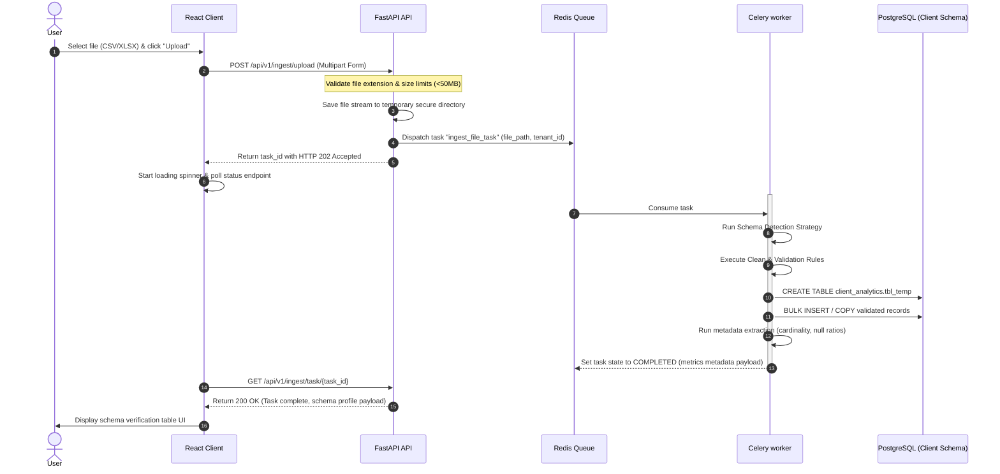

# Data Ingestion Layer Specifications: InsightFlow

## Document Metadata
- **Product Name**: InsightFlow
- **Document Version**: 1.0.0
- **Status**: Draft
- **Author**: Senior Data Platform Architect
- **Target Release Date**: Q4 2026

---

### 1. Data Source Architecture

InsightFlow’s data ingestion layer adopts a decoupled, staging-to-analytics paradigm to parse file uploads (CSV, Excel) and remote relational connections (PostgreSQL) securely:

```
[User Ingest Gateway]
       |
       +---> [File Ingestion Channel] (CSV, XLSX) ----> [S3 / MinIO Temporary Object Storage]
       |                                                    |
       +---> [Relational Connection Channel] (Postgres)     |
                                                            v
                                             [Asynchronous Celery Workers]
                                                            |
                                             +--------------+--------------+
                                             |                             |
                                             v                             v
                                [Type Inference Engine]        [Validation & Cleansing Node]
                                             |                             |
                                             +--------------+--------------+
                                                            |
                                                            v
                                            [Logical Client Schema Mapper]
                                                            |
                                                            v
                                       [Client Analytical Schema (PostgreSQL)]
```

#### Ingestion Layers:
1. **Raw Staging Layer**: Stores files as raw binary objects in isolated staging Buckets.
2. **Operational Metadata Layer**: Tracks connections schema types and parameters inside the platform database (`insightflow_system`).
3. **Structured Analytical Warehouse Layer**: Ingested data is unpacked into dedicated tables under a separate PostgreSQL schema for each tenant (`client_analytics_tenant_id`).

---

### 2. Upload Workflow



---

### 3. Schema Detection Strategy

To prevent database execution breaks, the **Type Inference Engine** scans files to infer database column layouts.

1. **Sampling Boundaries**: Scans the first 1,000 rows of the file (or the full file if it contains fewer rows) to determine datatypes.
2. **Priority Type Checker Hierarchy**:
   - **Boolean**: Checked first. Matches values `[true, false, 1, 0, yes, no, y, n]`.
   - **Integer**: Checks if values strictly conform to numeric regex values `^-?[0-9]+$`.
   - **Numeric / Decimal**: Checks if values fit standard floats `^-?[0-9]*\.[0-9]+$`.
   - **Timestamp**: Runs date parsing routines (`python-dateutil`) to test standard timestamp models (e.g. `YYYY-MM-DD`, `ISO 8601`).
   - **Varchar (String)**: Default fallback if no numerical or date checks succeed.
3. **Collision Resolution**: If a column displays mixed datatypes (e.g., 990 rows of integers, 10 rows containing "N/A" strings), the engine automatically promotes the column to `VARCHAR` to prevent data truncation during bulk loading.

---

### 4. Data Validation Rules

InsightFlow enforces strict ingestion constraints before writing data:

- **Uniqueness Boundaries**: Ensures columns marked as primary keys contain zero duplicate values.
- **Null Value Enforcement**: Ensures columns marked as `NOT NULL` do not contain empty blocks or invalid placeholders.
- **Data Size Limits**: Restricts `VARCHAR` sizes to standard definitions (e.g., 255 chars) to prevent SQL memory overflow.
- **Data Range Assertions**: Ensures numerical statistics fit within logical boundaries (e.g., `revenue >= 0`, `margins` between `-100` and `100`).

---

### 5. Data Cleaning Strategy

Messy datasets are automatically cleaned to ensure optimal downstream analytical performance:

| Error Type | Detection Rule | Automated Cleaning Action |
| :--- | :--- | :--- |
| **NaN / Null values** | Finds empty string blanks, `N/A`, `NaN`, `NULL` | Replaces with database `NULL` markers. |
| **Trailing Whitespaces**| Text columns containing leading/trailing spaces | Performs trimming operations. |
| **Messy Dates** | Variant date strings (e.g. `12/31/2026` vs `2026-12-31`) | Formats all values to ISO standard `YYYY-MM-DD HH:MM:SS`. |
| **Currency Symbols** | Numbers prefixed with `$`, `€`, or commas | Strips symbols and converts strings to pure `NUMERIC(15,4)`. |

---

### 6. Metadata Extraction

Post-ingestion, the system extracts structural metadata to populate the Semantic Layer catalog:

1. **Statistical Profiles**: Computes row counts, column counts, cardinality ratios (unique values / row counts), null ratios, and min/max boundaries.
2. **LLM Schema Summarization**:
   - Compiles table names and column names into a JSON document.
   - Prompts local Qwen3 to generate short descriptions for the table and its columns:
     ```
     Input: Table "fact_orders" with columns [order_id, customer_id, order_value]
     AI Output: "This table tracks customer order sales transactions. 'order_value' represents gross order revenue."
     ```
   - Embeds these generated descriptions and saves them to pgvector to enable natural language query matching.

---

### 7. PostgreSQL Storage Strategy

1. **Multi-Tenant Schema Isolation**:
   - Each tenant's ingested tables are kept under a dedicated logical schema: `client_analytics_<tenant_id>`.
   - Ensures tenant users can never query tables from other organizations, even if they bypass backend gate filters.
2. **Partitioning**: Large transaction log tables (e.g. `fact_sales` > 10M rows) are automatically partitioned by month or year using PostgreSQL declarative table partitioning.
3. **Index Configurations**:
   - Auto-indexes foreign keys in star-schema setups to optimize query performance.
   - Automatically builds B-Tree indexes on date columns used in time-series queries.

---

### 8. User Experience (UX) Flow

1. **Step 1: Upload Source Selector**: User selects "Upload File" (CSV, Excel) or "Connect Database" (PostgreSQL).
2. **Step 2: File Selector Drop-Area**: A drag-and-drop file interface displaying upload indicators and size indicators.
3. **Step 3: Schema Verification Panel**:
   - Shows inferred columns, sample values, and database types in a table grid.
   - Lets users manually change datatypes via a dropdown (e.g., overriding `Integer` to `Varchar`).
4. **Step 4: Connect & Indexing Progress Timeline**: Shows a status checklist:
   - `[x] File Upladed Successfully`
   - `[x] Schema Detected & Inferred`
   - `[/] Indexing Semantic Layer Metrics...`
5. **Step 5: Workspace Ready**: Displays a success banner: *"Your database is connected. You can now analyze this data in the AI Analyst workspace!"*

---

File Name: docs/DATA_INGESTION_sydney.md
